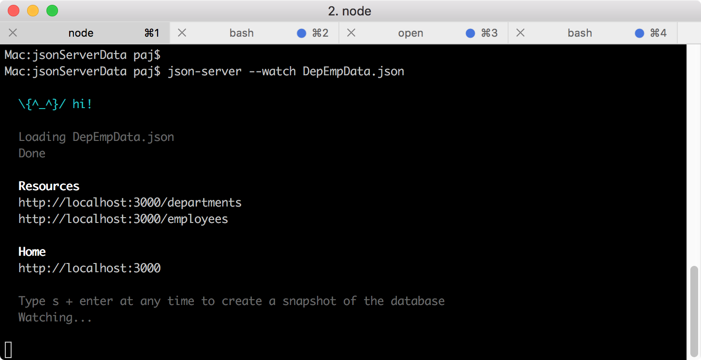
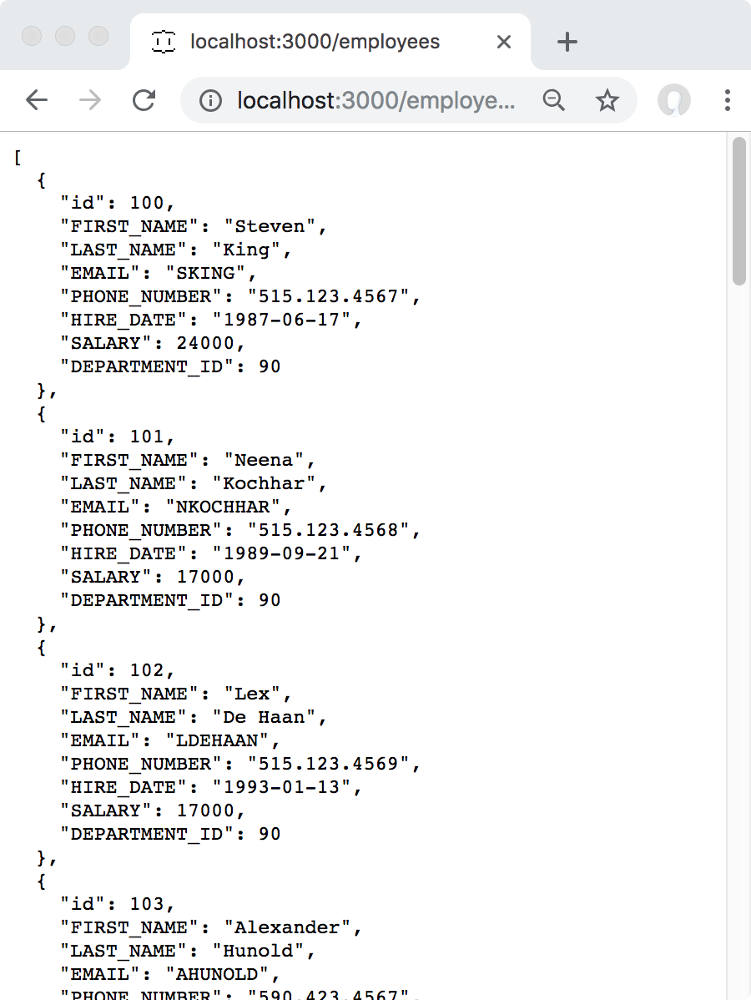
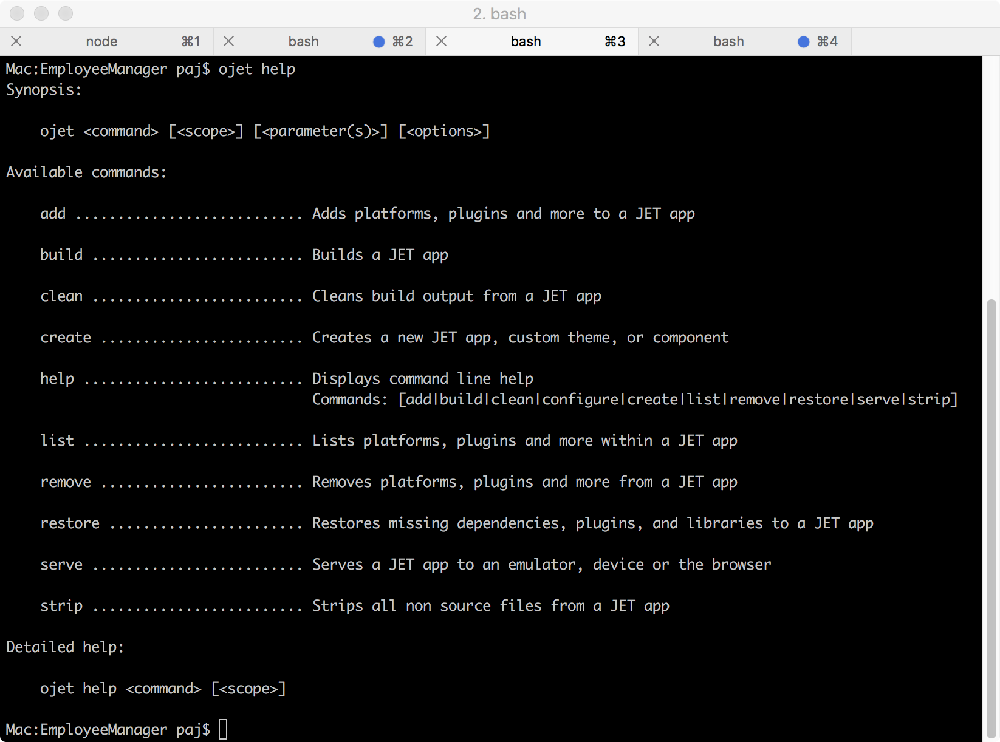
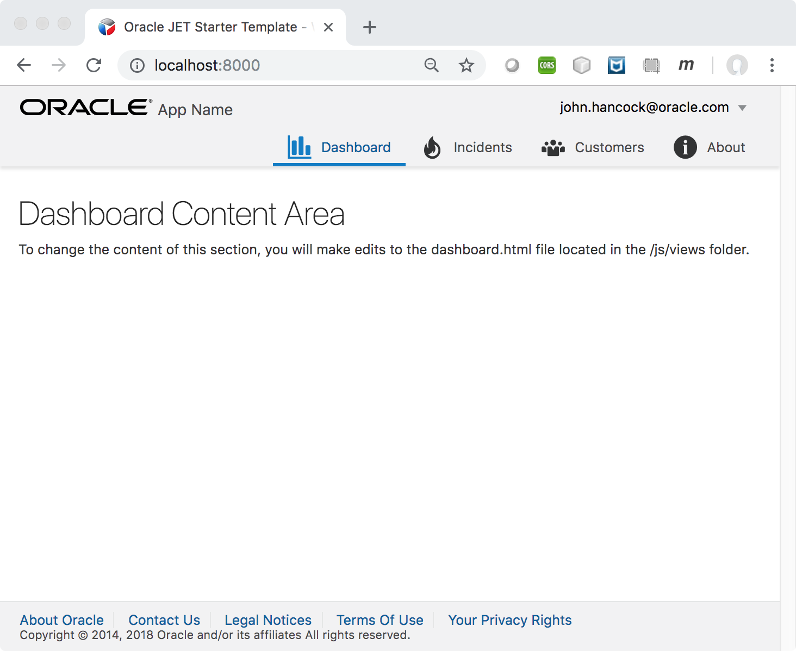
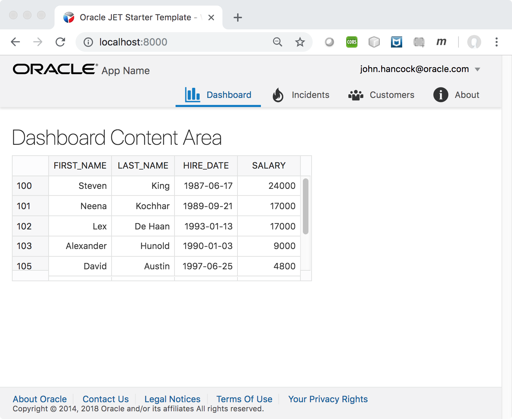
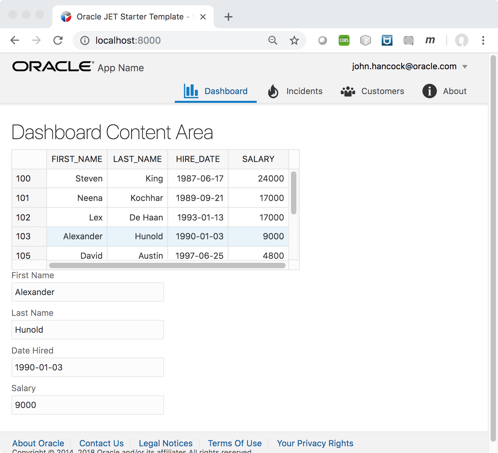
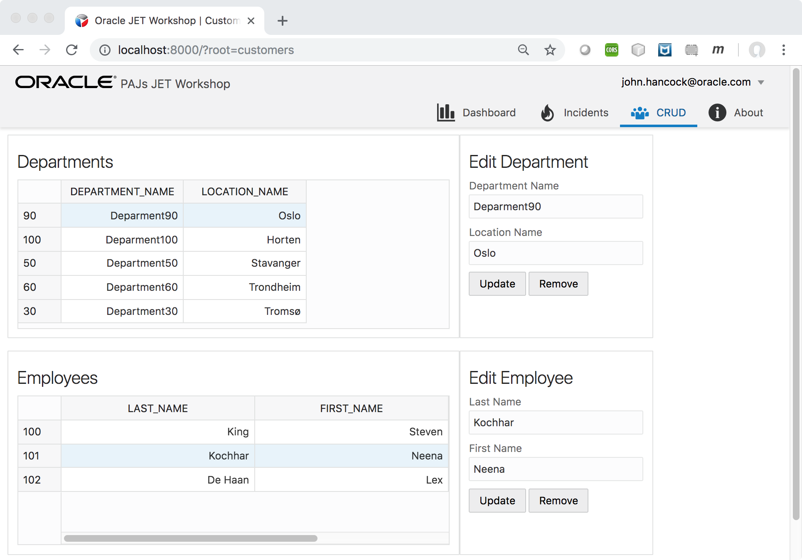

# Workshop: Master Detail CRUD Workshop with Oracle JET

The purpose of this script is to show how to put together a CRUD scenario in an Oracle JET application by means of Web Components. You'll start by setting up [JSON Server, which is a fake REST server](https://scotch.io/tutorials/json-server-as-a-fake-rest-api-in-frontend-development), next you'll set up an Oracle JET application that connects to it and displays its payload, and finally you add functionality for interacting with CRUD functionality defined in the application.

**Tip:** Go here to follow a free three week MOOC about Oracle JET: [oracle.com/goto/jet](https://www.oracle.com/goto/jet).

**Troubleshooting:** If you run into problems, go here for the completed source files: [bit.ly/learn-jet-result](http://bit.ly/learn-jet-result)

The application you'll create in this workshop will look as follows:

<table><tr><td>   

</td></tr></table>

#### Table of Contents

Part 1: Set Up the Environment
   * Getting the Node Package Manager
   * Getting Data
   * Getting Oracle JET

Part 2: Simple Usage of Oracle JET
   * Creating an Oracle JET Application
   * Showing Data in an Oracle JET Grid
   * Displaying the Selected Data in an Oracle JET Form

Part 3: CRUD and Master Detail using Oracle JET
   * Creating CRUD Functionality

Part 4: Optional
   * Pop up edit windows

## Part 1: Set Up the Environment

All the activities in this section should be done on the command line in a Terminal window.

### (a) Getting the Node Package Manager

Node.js is a JavaScript runtime, which provides 'npm', that is, the Node Package Manager, that you will use in the sections that follow to set up the environment that you need.

To verify the Node Package Manager is installed, run the following, which should show you the version of the Node Package Manager:
```js #button { border: none; }   
npm -v
```

If version 5.6.0 or higher is not shown, you need to install the latest LTS version of Node.

Download and install the latest LTS version of Node from http://nodejs.org.

### (b) Getting Data

In this part, you set up the [JSON Server](https://scotch.io/tutorials/json-server-as-a-fake-rest-api-in-frontend-development) to publish mock data that will be visualized in the Oracle JET application that you'll create via the instructions that follow.

   1. Set up the JSON Server, as follows:
```js #button { border: none; }   
npm install -g json-server
```   
Details: https://github.com/typicode/json-server

   2. Download and put this file anywhere on disk:
https://raw.githubusercontent.com/peranders/ojet-ws/master/DepEmpData.json

**Tip:** Do not put the above file in an Oracle JET application, instead, put it somewhere completely separate, e.g., on your Desktop, and run the command below in the Terminal window from the location of the employeeData.json file.

   3. Run in the Terminal window:
```js #button { border: none; }
json-server --watch DepEmpData.json
```
You should see something like this:
      <table><tr><td>   
      
      </td></tr></table>

   4. Go to http://localhost:3000/employees and see your employee data via your fake REST endpoint:

<table><tr><td>   

</td></tr></table>

Try the same thing with http://localhost:3000/departments

Json server also support a lot of other variants like: http://localhost:3000/employees?DEPARTMENT_ID=90 that only shows employees in the given department.

**Tip:** Optionally, follow the steps at http://bit.ly/jet-api to use Oracle Apiary, which is a part of Oracle API Platform Cloud Service, to design an API. Name your new API Project *employees*, copy the content from https://github.com/peranders/ojet-ws/blob/master/DepEmpData.json, and follow the instructions. Apiary comes with a mock server which will give you the same functionality as provided by the [JSON Server](https://scotch.io/tutorials/json-server-as-a-fake-rest-api-in-frontend-development).

### (c) Getting Oracle JET

In this part, you install the Oracle JET 6.0.0 command-line interface.

1. Install the Oracle JET command-line interface:

```js #button { border: none; }
npm install -g @oracle/ojet-cli
```

2. Run the following to check installation succeeded and to see the available commands:

```js #button { border: none; }
ojet help
```

You should see this:

<table><tr><td>   

</td></tr></table>

3. Run the following to check that you have the correct version of Oracle JET:

```js #button { border: none; }
ojet --version
```

You should see this:

```html #button { border: none; }
Oracle JET Command Line Interface, version: 6.0.0
```

**Tip:** If you have a different version of the Oracle JET command-line interface, please reinstall, using the command in step 1 above to do so.

You are now ready to get started with Oracle JET!

## Part 2: Simple Usage of Oracle JET

In this part, you set up a new Oracle JET application, explore the Oracle JET Cookbook, and set up a grid and form that display the data published in the previous part.

### (a) Creating an Oracle JET Application

1. Run the following in the terminal:

```js #button { border: none; }
ojet create EmployeeManager --template=navdrawer
```
**Note:** This process may take some time.

2. CD into 'EmployeeManager' and run the following in the terminal and look in the browser:

```js #button { border: none; }
ojet serve
```

After a few moments, you should see this:

<table><tr><td>   

</td></tr></table>

3. In your editor, open the sources, explore the structure, and learn about what everything does.

4. Make a change in the 'src/js/views/dashboard.html' file and notice what happens in the browser, without needing to refresh.

### (b) Showing Data in an Oracle JET Grid

1. Explore the Oracle JET Cookbook: go to oraclejet.org, click 'Use Cookbook', and look around.

Especially, for purposes of these instructions, take a look at the ojDataGrid and CRUD scenarios:

http://www.oracle.com/webfolder/technetwork/jet/jetCookbook.html?component=crud&demo=CRUDGrid

http://www.oracle.com/webfolder/technetwork/jet/jsdocs/oj.ojDataGrid.html

In the above, look at the JS documentation, the description, variations, etc.

2. Here is a simple ojDataGrid, a simplified version of the above references. Copy it below and paste it into the 'dashboard.html' file in your application (make sure you are editing only files under /src directory):

```html #button { border: none; }
<oj-data-grid
     id="datagrid"
     style="height:200px; max-width:477px"
     data="[[dataSource]]"
     selection-mode.row="single"
     dnd.reorder.row="enable"
     header.column.style="width:100px" >
</oj-data-grid>
```

3. Above, notice that 'dataSource' is referenced, which you need to define in 'src/js/viewmodels/dashboard.js'. Copy/paste the following code for that purpose into 'src/js/viewmodels/dashboard.js' (paste it directly below the 'var self = this' statement):

```js #button { border: none; }
self.url = 'http://localhost:3000/employees';

self.collection = new oj.Collection(null, {
    model: new oj.Model.extend({
        idAttribute: 'id',
        urlRoot: self.url}),
    url: self.url
});

self.dataSource = new oj.CollectionDataGridDataSource(
   self.collection, {
      rowHeader: 'id',
      columns: ['FIRST_NAME', 'LAST_NAME', 'HIRE_DATE', 'SALARY']
   });
```  

**Note:** In the above, we're making use of constructs that help you to quickly and effectively model and display your underlying data, in particular, [oj.Model](https://docs.oracle.com/cd/E86256_01/jet/reference-jet/oj.Model.html), [oj.Collection](https://docs.oracle.com/cd/E86256_01/jet/reference-jet/oj.Collection.html), and [oj.CollectionDataGridDataSource](https://docs.oracle.com/cd/E86256_01/jet/reference-jet/oj.CollectionDataGridDataSource.html). In turn, these concepts are based on Backbone syntax, e.g., [Backbone 'Collections'](http://backbonejs.org/#Model-Collections).

4. To use the 'ojDataGrid', reference the following at the end of the dependency list passed into the define() call of the 'dashboard.js' file:

```js #button { border: none; }
'ojs/ojdatagrid', 'ojs/ojcollectiondatagriddatasource'
```

5. Save your changes. In your application, you should now see this:

<table><tr><td>   

</td></tr></table>

**Tip:** Optionally, for centralized management of your endpoints, create a new folder under your src/js folder called 'data'.  Then create a new file called 'restservices.json' in that folder. Load it in the dependency list passed into the define() call as 'text!../data/restservices.json', reference it as 'restservices' in the callback function, and then replace hardcoded references to http://localhost:3000/employees with 'JSON.parse(endpoints).employees', assuming the file's content is as follows:

```js #button { border: none; }
{
    "employees": "http://localhost:3000/employees"
}
```

**Note:** Be aware that the order in which the parameters are listed in the dependency list passed into the define() call must match the order in which they are referenced in the callback function, i.e., 'text!../data/restservices.json' is 4th in the list in the dependency list passed into the define() call and therefore its reference 'endpoints' must be 4th in the list in the callback function, as shown below:

```js #button { border: none; }
define(['ojs/ojcore', 'knockout', 'jquery', 'text!../data/restservices.json',
    'ojs/ojdatagrid', 'ojs/ojcollectiondatagriddatasource'],
        function (oj, ko, $, restservices) {
```

What does 'text!' mean? That's the protocol defined by https://github.com/requirejs/text, which is part of Oracle JET, used for loading text resources, such as 'restservices.json'.

Now, replace the hardcoded url statement in dashboard.js with this:
```js #button { border: none; }
//self.url = 'http://localhost:3000/employees';
self.url = JSON.parse(restservices).employees;
```

After adding new files, first kill the 'ojet' process in the Terminal window, using Ctrl-C, and then restart it. The 'watch' process, provided by 'ojet', will only look for changes to existing files; it will not build and re-serve new files.

### (c) Displaying the Selected Data in an Oracle JET Form

In this section, you'll add a form that will display the values of the currently selected row, as shown here:

<table><tr><td>   

</td></tr></table>

1. Add properties, using [Knockout observables](http://knockoutjs.com/documentation/observables.html), to the 'dashboard.js' file after your datasource statements:

```js #button { border: none; }
var nextKey = 121;
self.inputEmployeeID = ko.observable(nextKey);
self.inputFirstName = ko.observable();
self.inputLastName = ko.observable();
self.inputHireDate = ko.observable();
self.inputSalary = ko.observable();
```

2. Add code for updating the model when there are changes in the view:

```js #button { border: none; }
//build a new model from the observables in the form
self.buildModel = function () {
   return {
     'id': self.inputEmployeeID(),
     'FIRST_NAME': self.inputFirstName(),
     'LAST_NAME': self.inputLastName(),
     'HIRE_DATE': self.inputHireDate(),
     'SALARY': self.inputSalary()
   };
};

//used to update the fields based on the selected row:
self.updateFields = function (model) {
   self.inputEmployeeID(model.get('id'));
   self.inputFirstName(model.get('FIRST_NAME'));
   self.inputLastName(model.get('LAST_NAME'));
   self.inputHireDate(model.get('HIRE_DATE'));
   self.inputSalary(model.get('SALARY'));
};
```

3. Create a selection handler that you'll be referencing in the grid:

```js #button { border: none; }
self.handleSelectionChanged = function (event) {
     var selection = event.detail['value'][0];
     if (selection != null) {
         var rowKey = selection['startKey']['row'];
         self.modelToUpdate = self.collection.get(rowKey);
         self.updateFields(self.modelToUpdate);
     }
};
```

4. Back in 'dashboard.html', add an attribute to connect selection changes to your handler above:

```html #button { border: none; }
on-selection-changed="[[handleSelectionChanged]]"
```

5. Display the values of the selected row in the table via the form below, add it below the grid in 'dashboard.html':

```html #button { border: none; }
<oj-form-layout id="form-container" label-edge="top">
    <oj-input-text id="firstNameInput" label-hint="First Name" value="[[inputFirstName]]"></oj-input-text>
    <oj-input-text id="lastNameInput" label-hint="Last Name" value="[[inputLastName]]"></oj-input-text>
    <oj-input-text id="inputHireDate" label-hint="Date Hired" value="[[inputHireDate]]"></oj-input-text>
    <oj-input-text id="inputSalary" label-hint="Salary" value="[[inputSalary]]"></oj-input-text>
</oj-form-layout>
```

6. To use the 'ojInputText' and 'ojDialog', reference the following at the end of the dependency list passed into the define() call of the 'dashboard.js' file:

```js #button { border: none; }
'ojs/ojinputtext', 'ojs/ojformlayout'
```

7. In your application, you should now see this, i.e., when a row is selected its values should be visible in the form:

<table><tr><td>   

</td></tr></table>


## Part 3: CRUD and Master Detail using Oracle JET

Now, we are going to create som master detail views and crud functionality. We are going to put that in the "Customer" tab.  First change the name of the tab from Customer to CRUD by modifying the navData section in the  appController.js file:
```js #button { border: none; }
// Navigation setup
var navData = [
{name: 'Dashboard', id: 'dashboard',
 iconClass: 'oj-navigationlist-item-icon demo-icon-font-24 demo-chart-icon-24'},
{name: 'Incidents', id: 'incidents',
 iconClass: 'oj-navigationlist-item-icon demo-icon-font-24 demo-fire-icon-24'},
{name: 'CRUD', id: 'customers',
 iconClass: 'oj-navigationlist-item-icon demo-icon-font-24 demo-people-icon-24'},
{name: 'About', id: 'about',
 iconClass: 'oj-navigationlist-item-icon demo-icon-font-24 demo-info-icon-24'}
];
```

We are going to retrieve a list of departments and the corresponding list of employees for that departments.  
We will also add basic update and delete functionality for the records. After you finish it will look something like this:

<table><tr><td>   

</td></tr></table>

We will start by adding the list of deparments.  The first thing we need to do is to update our pointers to the rest endpoints for retrieving the departments and list of emploees for each department. Modify your restservices.json file in the srs/data directory like this:

```js #button { border: none; }
{
  "employees": "http://localhost:3000/employees",
  "departments": "http://localhost:3000/departments",
  "empsByDepartment": "http://localhost:3000/employees?DEPARTMENT_ID="
}
```

To reference the restservices.json file and the other ui components we are going to use in this tab, add the following to the define section at the top of the customers.js file with this:
```js #button { border: none; }
,'jquery','text!../data/restservices.json', 'ojs/ojdatagrid', 'ojs/ojcollectiondatagriddatasource','ojs/ojinputtext', 'ojs/ojformlayout', 'ojs/ojmasonrylayout'
```

Then add restservices as a parameter to the function.  The completed function definition should now look like this:
```js #button { border: none; }
define(['ojs/ojcore', 'knockout', 'jquery','text!../data/restservices.json', 'ojs/ojdatagrid', 'ojs/ojcollectiondatagriddatasource','ojs/ojinputtext', 'ojs/ojformlayout', 'ojs/ojmasonrylayout'],
 function(oj, ko, $, restservices) {
```

We will start by adding the list of departments. Open the customer.js file and add the following lines after "var self = this":
```js #button { border: none; }
//Set data source endpoint
self.DeptUrl = JSON.parse(restservices).departments;
self.EmpsByDeptUrl = JSON.parse(restservices).empsByDepartment;
self.EmpUrl = JSON.parse(restservices).employees;
```
Then add the DepCollection object and datasource for the grid after your datasouce endpoints:
```js #button { border: none; }
//Set collections
self.DepCollection = new oj.Collection(null, {
    model: new oj.Model.extend({idAttribute: 'id'}),
    url: self.DeptUrl
  }
);

//Set datasources for oj-data-grid
self.deptDataSource = new oj.CollectionDataGridDataSource(
  self.DepCollection, {
    rowHeader: 'id',
    columns:['DEPARTMENT_NAME', 'LOCATION_NAME']
  });
```
Open customers.html and replace the content with the datagrid for holding the list of Departments:

```js #button { border: none; }
<div class="oj-flex" style="width: 100%">
  <div class="oj-flex-item oj-flex oj-sm-flex-items-1 oj-sm-12 oj-md-6 oj-lg-7 oj-xl-7">
    <div class="oj-flex-item oj-panel">
      <h2>Departments</h2>
      <div>
        <oj-data-grid
          id="depDatagrid"
          style="height:200px; max-width:600px"
          aria-label="Data Grid CRUD Demo"
          data="[[deptDataSource]]"
          selection-mode.row="single"
          dnd.reorder.row="enable"
          header.column.style="width:45%">
        </oj-data-grid>
      </div>
    </div>
  </div>
```
Refresh the page and you should now see a list of Departments.   

Now add a form to update selected departments.  We start by adding a function for handling the selection of a Department in the list. Add the following to customers.js:
```js #button { border: none; }
self.handleDepSelectionChanged = function (event) {
  var selection = event.detail['value'][0];
  if (selection != null) {
    var rowKey = selection['startKey']['row'];
    self.modelToUpdate = self.DepCollection.get(rowKey);
    self.updateDepFields(self.modelToUpdate);

    //handle emp listing
    var depId = self.modelToUpdate.get('id');
    self.refreshEmployeeList(depId);
    self.resetEmpFields();
  }
};
```
Then reference to this function by adding the following line inside the oj-data-grid tag in customers.html:
```js #button { border: none; }
on-selection-changed="[[handleDepSelectionChanged]]"
```
Then add the form to show the selected department.  Copy this before the last </div> tag in customers.html:
```js #button { border: none; }
<div class="oj-flex-item oj-flex oj-sm-flex-items-1 oj-sm-12 oj-md-4 oj-lg-3 oj-xl-2">
  <div class="oj-flex-item oj-panel">
    <h2>Edit Department</h2>
    <div>
      <oj-form-layout id="dep-form-container" label-edge="top">
        <oj-input-text id="departmentNameInput" label-hint="Department Name" value="{{inputDepartmentName}}"></oj-input-text>
        <oj-input-text id="locationNameInput" label-hint="Location Name" value="{{inputLocationName}}"></oj-input-text>
      </oj-form-layout>
    </div>

   <!-- Copy Buttons section here -->

  </div>
</div>
```

To handle the form and update fields add the following code segment after your datasource endpoints on the top of customer.js:
```js #button { border: none; }
//Set local vars to hold form values
var nextKey = 121;
self.inputDepartmentID = ko.observable(nextKey);
self.inputDepartmentName = ko.observable();
self.inputLocationName = ko.observable();
```
Then add the following function below:
```js #button { border: none; }
//Function that creates json payload from fields in update form
self.buildDepModel = function () {
 return {
   'id': self.inputDepartmentID(),
   'DEPARTMENT_NAME': self.inputDepartmentName(),
   'LOCATION_NAME': self.inputLocationName()
  };
};
```

Then add the following function to update the form elemtents when the selection in the grid changes:
```js #button { border: none; }
// Function to update fields in update form
self.updateDepFields = function (model) {
  self.inputDepartmentID(model.get('id'));
  self.inputDepartmentName(model.get('DEPARTMENT_NAME'));
  self.inputLocationName(model.get('LOCATION_NAME'));
};
```


```js #button { border: none; }

```


Experiment with other components in the Oracle JET Cookbook and see what they look like in Arabic:

http://www.oracle.com/webfolder/technetwork/jet/jetCookbook.html
